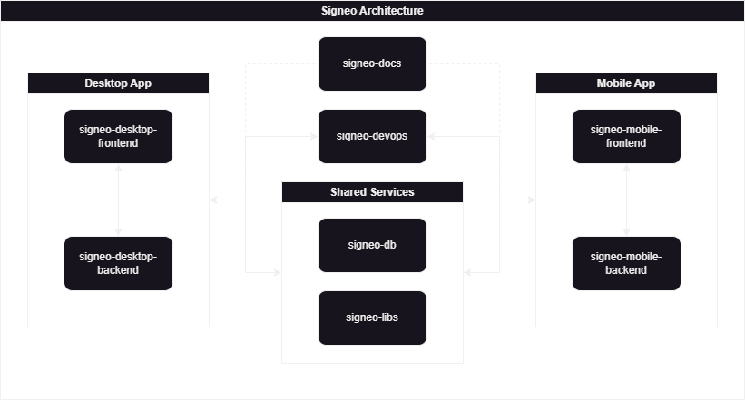

# Signeo Documentation

This repository contains all the documentation for the Signeo project, including setup guides, API references, and contributor instructions.

## Contents
- **Setup Guides**: Instructions for configuring and running Signeo applications.
- **API References**: Detailed documentation for Signeo’s APIs.
- **Contributor Instructions**: Guidelines for contributing to the project.

## Project Architecture

The high-level architecture for Signeo's components is shown below:

